# Missão Prática | Nível 3 | Mundo 4


- Introdução

```
Esta atividade esta dividida em duas partes sendo a primeira a 
de Microatividades (Parte 1) e a segunda, desenvolvimento de um App (Parte 2)
```


- Objetivos da prática
```
  - Instalação do Android Studio e do emulador;
  - Criar um app para Wear OS;
  - Executar um app no emulador;
  - Fazer capturas de telas no Android Studio;
  - Fazer capturas de telas com app complementar.
``` 

 - Especificação

https://sway.cloud.microsoft/s/EmYWGfbAKD99npjX/embed


 

# Microatividades  


## 1 - Preparação do ambiente

- Material necessário para a prática
 
  - Android Studio  
  - Git para controle de versionamento;
  - Emulador Android  

- Descrição

``` 
Esta atividade tem como objetivo preparar a configuração do ambiente de
desenvolvimento apps "Wear Os" para a plataforma Windows 
 
``` 
Baixando o android studio : https://bit.ly/3vdV03G

 - Navegue atá o final da pagina e escolha a versão recomendada para seu sistema operacional

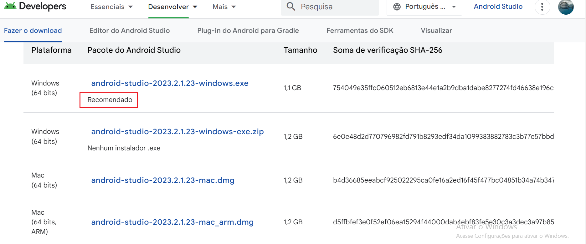

<BR>

Instalando o android studio : https://bit.ly/492ToHS
 
 ```
  Procure seu sistema operacional e confirme os requisitos minimos de instalação e  
e instale o pacote baixado anteriormente

```
 
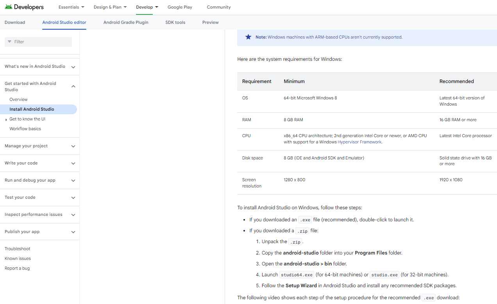

   ```
    Concluindo a instalação, você obtera o seguinte resultado
   ```


 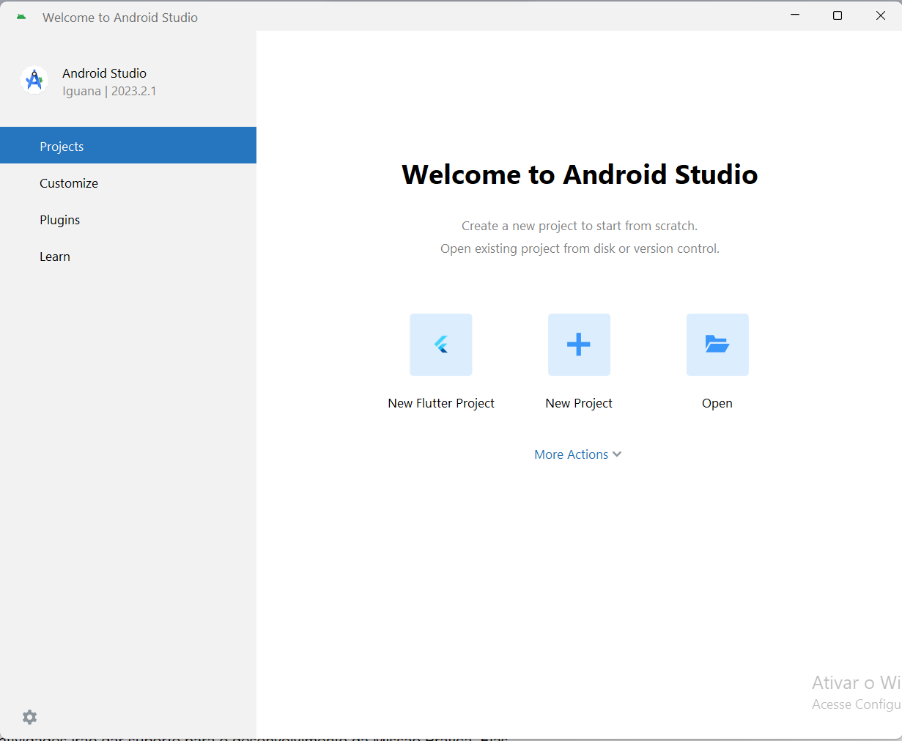

 
 ### Configurações adicionais

Para configurar o Android Studio no ambiente Windows de forma eficiente, além da instalação padrão, existem algumas configurações adicionais e otimizações que você pode realizar para garantir um ambiente de desenvolvimento mais robusto e ágil. Aqui estão algumas dessas configurações adicionais:

### 1.1  **Variáveis de Ambiente**

- **JAVA_HOME**: Certifique-se de que o `JAVA_HOME` está configurado corretamente em suas variáveis de ambiente, apontando para o JDK (Java Development Kit) que o Android Studio usa. Isso é crucial para que o Android Studio e outras ferramentas de linha de comando, como o Gradle, funcionem corretamente.


- **ANDROID_HOME**: Embora o Android Studio configure automaticamente o SDK do Android durante a instalação, é uma boa prática definir a variável de ambiente `ANDROID_HOME` para apontar para o local do SDK do Android no seu sistema. Isso pode ser útil para ferramentas de linha de comando.

um pequeno tutorial para variaveis de ambiente : https://www.youtube.com/watch?v=V__Ifd3SdxM

### 1.2  **Configuração do Gradle (opcioal) **

- **Gradle Wrapper vs Gradle Local**: O Android Studio usa o Gradle Wrapper por padrão, o que é recomendado pois garante que todos os desenvolvedores de um projeto usem a mesma versão do Gradle. No entanto, você pode configurar o Android Studio para usar uma instalação local do Gradle se precisar de uma versão específica ou quiser melhorar o tempo de construção.

- **Aumentar a Memória do Gradle  (opcioal) **: Para projetos grandes, aumentar a alocação de memória para o processo do Gradle pode melhorar o desempenho da construção. Isso pode ser feito editando o arquivo `gradle.properties` no seu projeto ou globalmente, adicionando a linha `org.gradle.jvmargs=-Xmx2048m` para aumentar a memória máxima do heap para 2048 MB, por exemplo.

### 1.3  **Configurações do Android Studio (opcioal) **

- **Aumentar a Memória do IDE**: Similar ao Gradle, aumentar a memória alocada para o Android Studio pode melhorar o desempenho, especialmente em máquinas com mais RAM disponível. Isso pode ser feito editando o arquivo `studio.vmoptions` ou através das configurações de memória no próprio IDE.

- **Habilitar o Modo de Economia de Energia**: Quando ativado, o modo de economia de energia desativa as análises de código em tempo real e outras funcionalidades que consomem muitos recursos, o que pode ser útil para economizar energia e recursos do sistema em máquinas menos potentes.

- **Plugins**: Instale apenas os plugins necessários, pois plugins adicionais podem consumir recursos do sistema. Avalie e mantenha apenas os que são essenciais para o seu desenvolvimento.

### 1.4  **Emulador Android (obs) **

- **Habilitar a Aceleração de Hardware**: Certifique-se de que a aceleração de hardware está habilitada para o emulador Android. Isso geralmente requer a instalação do HAXM (Intel Hardware Accelerated Execution Manager) ou a ativação do WHPX (Windows Hypervisor Platform) em sistemas que suportam.

- **Configurar Dispositivos Virtuais com Recursos Adequados**: Ao criar dispositivos virtuais no AVD Manager, escolha configurações que correspondam ao seu desenvolvimento, mas esteja ciente dos recursos do seu sistema para não sobrecarregá-lo.

### 1.5  **Atualizações**

- **Manter o Android Studio e o SDK Atualizados**: A Google frequentemente lança atualizações para o Android Studio e para o SDK do Android, incluindo correções de bugs, melhorias de desempenho e novos recursos. Manter seu ambiente de desenvolvimento atualizado pode ajudar a garantir a melhor experiência de desenvolvimento.

Essas configurações e otimizações podem ajudar a criar um ambiente de desenvolvimento Android mais eficiente e agradável no Windows.
  
<BR>

### Criação do emulador "WEAR OS"

``` 
 Abra seu Android Studio e selecione 'mode actions'.'Virtual Device Manager'

``` 

 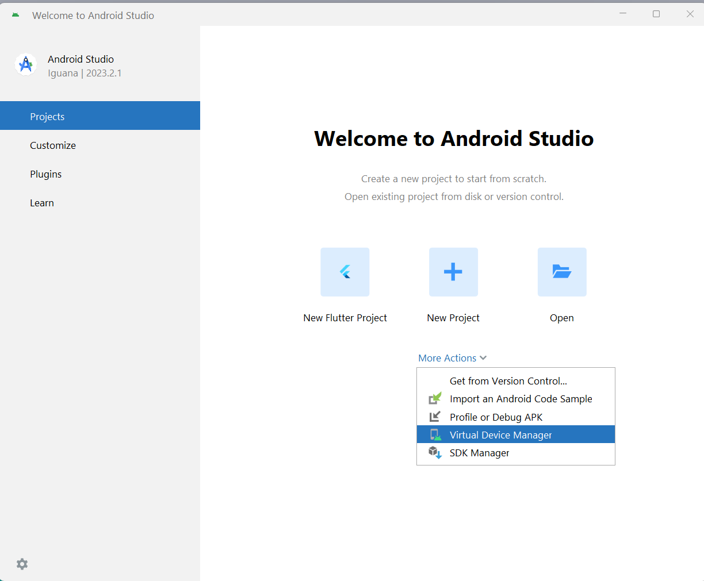
 <BR>

``` 
 Na versão de meu android studio se tem um botão '+' ao alto a direita onde
 serão apresentadas as opções que no nosso caso seão as 'Wear OS'   
``` 

  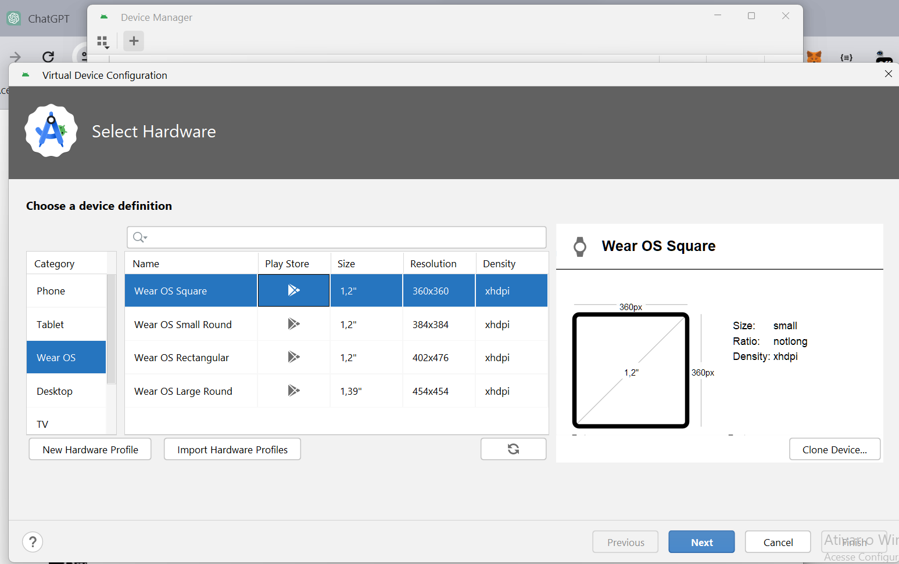
 <BR>

``` 
 Prosigua conforme recomendação e baixe a imagem caso necessário. Observe que 
neste caso a imagem já se encontra disponivel sem necessidade de download
``` 

  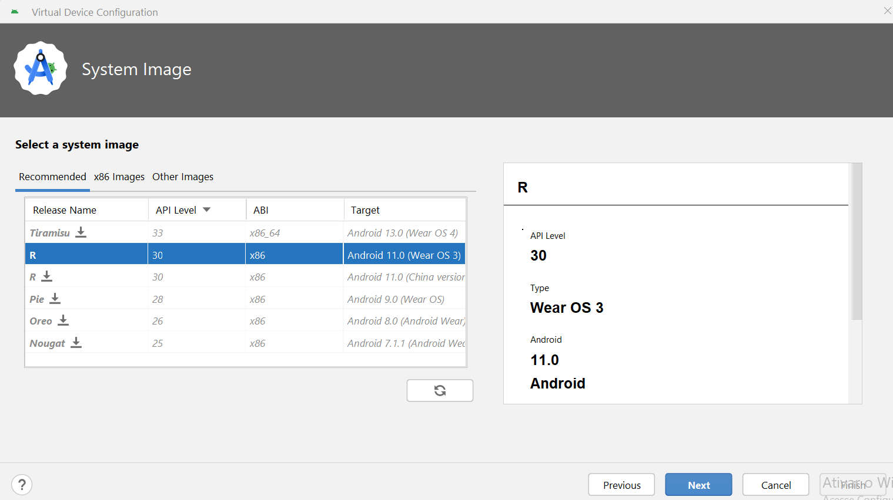
 <BR>
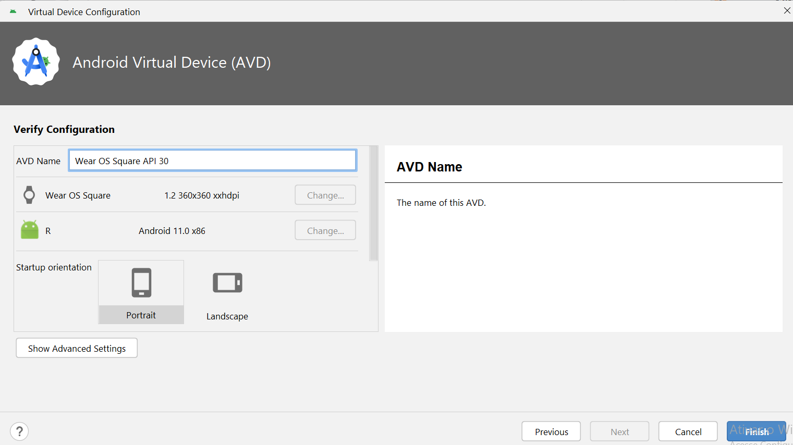
 <BR>
 
 <BR>

``` 
obs: no meu caso, já haviam outros emuladores, esse ultimo foi adicionado
a titulo de exemplo

``` 

## 2 - Criando um novo projeto no Android Studio
``` 
Criar um novo projeto
``` 
 <BR>
 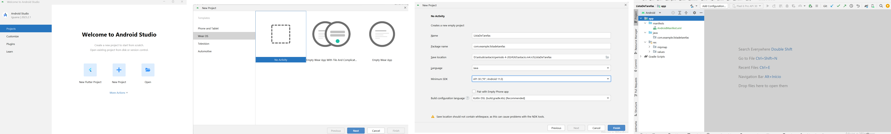
 <BR>

 ## 3 -  Arquivos de Lógica e Configurações
 
 Procedimentos 💻

   3.1 Criação da MainActivity: Crie a `MainActivity.java` clicando com o botão direito em
"app" e selecione New > Activity > Empty Views Activity..

   3.2   Nome e Layout da Atividade: Na janela, mantenha o nome da atividade como
`MainActivity` e o "Layout Name" como `activity_main`.

 <BR>
 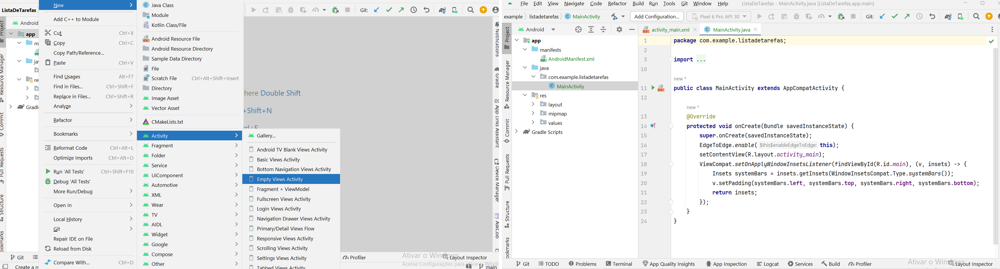
 <BR>

3.3    Interface de Usuário: Desenvolva a interface da primeira tela do aplicativo com
uma `ListView` e um `Button`.

 <BR>
 
 <BR>

3.4    Permissões no AndroidManifest.xml: Localize o `AndroidManifest.xml` na pasta
manifests e adicione as permissões:

     <uses-permission android:name="android.permission.BODY_SENSORS"/>

     <uses-permission android:name="android.permission.WAKE_LOCK"/>

  <BR>
 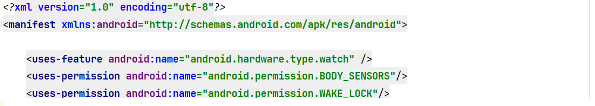
 <BR>    
 
  ``` 
Isso permite a interação com partes do sistema.

``` 

3.5    Intent-filter para MainActivity: No arquivo maAdicione o elemento `intent-filter`
para especificar as intents que a atividade pode responder, respondendo a intents com
a ação MAIN e a categoria LAUNCHER. Exemplo:

```
   <intent-filter>

         <action android:name="android.intent.action.MAIN" />

         <category android:name="android.intent.category.LAUNCHER" />

     </intent-filter>

```
  <BR>
 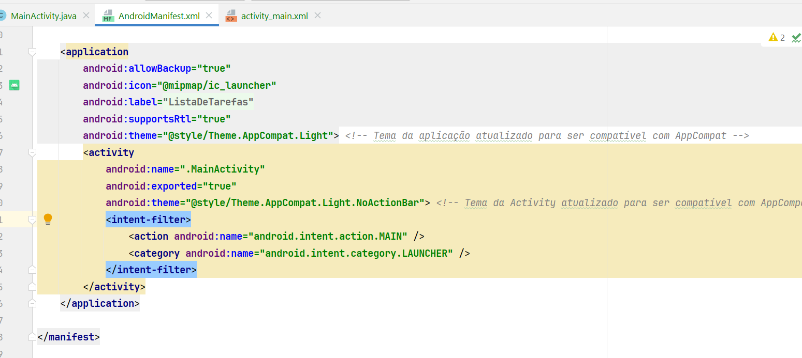
 <BR>    

 3.6    Dependências no build.gradle: Na área Gradle Scripts, temos o build.gradle, e lá
encontraremos as dependências do projeto.
  <BR>
 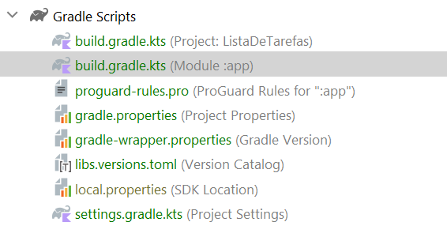
 <BR>  

 ## 4 - Criando um emulador

 - Procedimentos 💻

      -  No Android Studio, acesse o Device Manager pelo caminho Tools > Device
Manager.  

  <BR>
 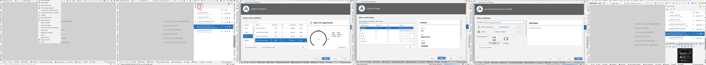
 <BR>  


 ## 5 - Fazer capturas de telas com app

- Procedimentos 💻

   1 Na IU, encontre a tela que você quer capturar.
   
   
   2 No smartphone Android, ative as Opções do desenvolvedor, se ainda não estiverem
ativadas. Para isso, acesse Configurações > Sobre o telefone e toque em Número
da versão sete vezes.
   3 Abra o app complementar do Wear no smartphone.
   4 Toque no botão flutuante de três pontos no canto superior direito para abrir o menu.
   5 Toque em “Fazer captura de tela do wearable”. Esta mensagem vai aparecer:
Solicitação de captura de tela enviada. Depois, você receberá estas notificações:
Pronto para enviar uma captura de tela do relógio e Toque para enviar.
   6 Toque na notificação para conferir as opções de envio ou compartilhamento da
captura de tela por Bluetooth, Gmail ou outros meios.

  <BR>
 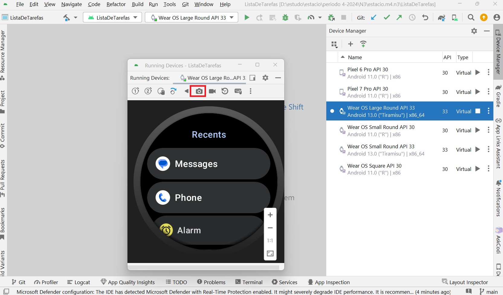
 <BR>  

```
obs: conforme pode ser visto, tenho todos os emuladores "Wear OS" e em nenhum deles econtrei as opções 
```

# Missão Prática | Lidando com sensores em dispositivos móveis

 A tarefa descrita envolve várias etapas importantes para a implementação de saídas de áudio em um aplicativo Android, incluindo a detecção de dispositivos de saída de áudio disponíveis, a detecção dinâmica de conexões e desconexões de dispositivos de áudio, e a facilitação da conexão Bluetooth. Vamos detalhar cada uma dessas etapas:

### 1. **Implementação de Saídas de Áudio**

A classe `AudioHelper` é projetada para verificar a disponibilidade de saídas de áudio específicas, como alto-falantes embutidos ou fones de ouvido Bluetooth. Utiliza o `AudioManager` para listar os dispositivos de saída de áudio e verificar se um tipo específico de dispositivo está disponível.

### 2. **Detecção Dinâmica de Dispositivos de Áudio**

O registro de um `AudioDeviceCallback` permite que o aplicativo seja notificado quando dispositivos de áudio são conectados ou desconectados. Isso é útil para ajustar a interface do usuário ou o comportamento do aplicativo com base na disponibilidade de dispositivos de saída de áudio específicos.

### 3. **Facilitando a Conexão Bluetooth**

Se o aplicativo requer que um fone de ouvido Bluetooth esteja conectado, mas nenhum está disponível, você pode direcionar o usuário para as configurações do Bluetooth do dispositivo. Isso é feito enviando uma `Intent` com a ação `Settings.ACTION_BLUETOOTH_SETTINGS`, potencialmente melhorando a experiência do usuário ao facilitar a conexão de dispositivos Bluetooth.

### 4. **Reprodução de Áudio**

Após detectar uma saída de áudio adequada, o aplicativo pode proceder com a reprodução de áudio usando APIs padrão do Android, como `MediaPlayer` ou `AudioTrack`. O processo é semelhante ao de qualquer dispositivo Android, seja ele um smartphone, tablet ou Wear OS.

### 5. **Uso de Alto-falantes em Dispositivos Wear OS**

Para dispositivos Wear OS com alto-falantes, incorporar funcionalidades de áudio pode enriquecer significativamente a experiência do usuário. Isso pode incluir a reprodução de alarmes sonoros, instruções de voz em apps de fitness, ou feedback auditivo em apps educativos.


### Apresentação do App concluido

 <BR>
 
 <BR>